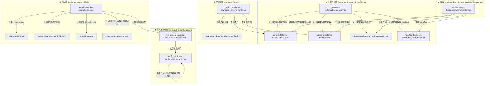

# Minecraft 实例生命周期架构分析与 lighty-launcher 迁移评估报告

本报告对 PiLauncher 当前的实例生命周期（包括下载部署、修复、升级降级、完整性校验、启动链）进行了系统性梳理，分析了它们之间的关联性与闭环设计，并针对整体迁移至 [lighty-launcher](https://docs.rs/lighty-launcher) 进行了可行性与难度的深度评估。

---

## 一、 当前实例生命周期架构分析

当前 PiLauncher 的生命周期管理采用了经典的分层架构：底层为基础的**文件下载与安装引擎**，中层为**实例状态服务**（校验、环境变更、创建），上层为**启动控制服务**。

各个模块的核心逻辑与文件映射如下：

### 各阶段逻辑细节

1. **实例下载部署 (Instance Download & Deployment)**
   - **入口**：[creation.rs](file:///h:/VSCodeWork/pilauncher/src-tauri/src/services/instance/creation.rs) 中的 `InstanceCreationService::create` 方法。
   - **调用流程**：
     - 在临时目录 `.tmp` 下初始化目录结构与 `instance.json`。
     - 调用 [core_installer.rs](file:///h:/VSCodeWork/pilauncher/src-tauri/src/services/downloader/core_installer.rs) 下载 Minecraft 原版核心 JAR 与 JSON。
     - 调用 [dependencies](file:///h:/VSCodeWork/pilauncher/src-tauri/src/services/downloader/dependencies) 下载库文件（Libraries）和资源文件（Assets）。
     - 若安装 Mod 加载器（Fabric/Forge/NeoForge/Quilt），调用 [loader_installer.rs](file:///h:/VSCodeWork/pilauncher/src-tauri/src/services/downloader/loader_installer.rs)。
     - 调用 [manifest_builder.rs](file:///h:/VSCodeWork/pilauncher/src-tauri/src/services/instance/manifest_builder.rs) 生成实例清单。
     - 重命名临时目录至最终实例目录，持久化至 SQLite 数据库。

2. **实例修复 (Instance Repair)**
   - **入口**：[verify_service.rs](file:///h:/VSCodeWork/pilauncher/src-tauri/src/services/instance/verify_service.rs) 中的 `download_missing_runtimes`。
   - **逻辑**：根据校验结果传入的 `MissingRuntime` 结构，**重用底层的下载和安装模块**（`install_vanilla_core`、`install_loader` 及强校验依赖下载），对缺失或损坏的文件进行精准重新下载和补充。

3. **实例升级降级 (Instance Upgrade & Downgrade)**
   - **入口**：[environment.rs](file:///h:/VSCodeWork/pilauncher/src-tauri/src/services/instance/environment.rs) 中的 `InstanceEnvironmentService::update`。
   - **逻辑**：当用户修改实例的游戏版本或加载器类型/版本时，修改配置后重新调用底层的下载部署管道，在同一个实例目录下更新底层核心、重构清单。

4. **完整性检测 (Pre-launch Integrity Check)**
   - **入口**：[pre_launch_check.rs](file:///h:/VSCodeWork/pilauncher/src-tauri/src/services/launcher/pre_launch_check.rs) 中的 `PreLaunchCheckService::run`。
   - **逻辑**：
     - 触发 [verify_service.rs](file:///h:/VSCodeWork/pilauncher/src-tauri/src/services/instance/verify_service.rs) 中的 `verify_instance_runtime`。
     - 加载版本清单（Version JSON），遍历所需要的库（Libraries）、原生库（Natives）、资源索引（Asset Index）及所有资产文件（Objects）。
     - 并行或逐个通过 SHA-1 哈希值校验本地文件，识别丢失和被篡改的文件。
     - 同时检查 Java 主版本是否符合版本最低要求（如 MC 1.20+ 需要 Java 17+）以及平台兼容性。

5. **实例启动链 (Instance Launch Chain)**
   - **入口**：[launcher/mod.rs](file:///h:/VSCodeWork/pilauncher/src-tauri/src/services/launcher/mod.rs) 中的 `LauncherService::launch_instance`。
   - **调用流程**：
     - **拦截器**：若启用启动前检查，调用 `PreLaunchCheckService::ensure_passed` 进行前置校验。
     - **参数准备**：调用 [resolver.rs](file:///h:/VSCodeWork/pilauncher/src-tauri/src/services/launcher/resolver.rs) 合并全局与实例配置；利用 `AuthService` 获取登录会话。
     - **补丁修补**：修改游戏目录下的 `options.txt`（如全屏参数），防止历史配置覆盖。
     - **命令构建**：使用 [LaunchCommandBuilder](file:///h:/VSCodeWork/pilauncher/src-tauri/src/services/launcher/builder.rs) 生成 JVM 与程序启动参数，并提取 Native 动态链接库至独立目录。
     - **进程管理**：生成 Java 进程，异步管道输出 Stdout/Stderr 游戏日志，并在游戏退出后触发自动存档备份（[SaveManagerService](file:///h:/VSCodeWork/pilauncher/src-tauri/src/services/instance/save_manager.rs)）及游玩时长统计（`PlaytimeService`）。

---

## 二、 链路与闭环分析

### 1. 它们是在一条链路吗？
**是的，它们共享相同的底层服务，并在启动时深度耦合。**
* **底层重用**：下载部署、环境升级/降级和实例修复在底层都调用了相同的下载子模块（`core_installer.rs`、`loader_installer.rs`）。
* **启动集成**：完整性检测（`PreLaunchCheckService`）被直接缝合在启动链（`LauncherService`）的起点，作为不可跳过的拦截哨兵。

### 2. 有没有形成闭环？
对于闭环的定义，需要从**交互级**和**代码级**两个维度来看：

#### A. 功能与用户交互层（已闭环 ✅）
* **检测 -> 报告 -> 修复 -> 启动** 构成了一个完整的用户体验闭环：
  1. 用户点击启动 -> 2. 启动链调用完整性检测 -> 3. 校验失败，返回 `VerifyInstanceRuntimeResult`，包含缺失的运行时 `MissingRuntime` -> 4. 启动链中断并通知前端 -> 5. 前端展示修复弹窗，用户确认 -> 6. 前端调用 `download_missing_runtimes` 接口修复 -> 7. 修复完成，用户再次启动 -> 8. 校验通过，成功进入游戏。

#### B. 纯后端代码级（未闭环 ❌ / 属于有意的设计分工）
* **无自动自愈**：后端启动链在校验失败时会直接 `return Err(AppError::Generic(...))` 抛出错误并中断，**不会**在后台自动触发 `download_missing_runtimes` 自愈后继续启动。
* **原因合理性**：
  * **用户知情权**：修复可能需要下载数 GB 的游戏资产，在后台默默下载会导致启动响应时间极长，甚至在弱网环境下卡死，必须将控制权交还前端，由用户授权。
  * **取消与并发控制**：下载过程需要消耗带宽，且需要向前端推送进度条（`instance-deployment-progress`），由前端做状态调度更为安全。

---

## 三、 迁移至 lighty-launcher 的可行性与难度评估

[lighty-launcher](https://docs.rs/lighty-launcher) 是一个用 Rust 编写的现代化、模块化 Minecraft 启动器核心库，提供了 JRE 管理、版本构建、依赖安装和命令行生成等功能。

### 1. 当前代码与 lighty-launcher 的架构映射

| 功能模块 | PiLauncher 当前实现方式 | lighty-launcher 对应实现 | 迁移匹配度 |
| :--- | :--- | :--- | :--- |
| **版本管理** | 手动读取 `/versions` 下的 JSON 并进行 Loader 类型推导 | `version::VersionBuilder` | 高 |
| **下载引擎** | 自建基于 `reqwest` 的分块下载与校验逻辑 | `lighty-core` (内置异步网络下载) | 中 |
| **加载器安装** | 自写 Fabric/Forge/NeoForge/Quilt JSON 解析与安装器 | `lighty-loaders` (原生支持) | 高 |
| **Java 管理** | 基于注册表/默认路径搜索，手动验证位数和版本 | `lighty-java` (JRE 自动下载与管理) | 高 |
| **参数生成** | `LaunchCommandBuilder` 繁琐地解析 JVM 与 Program Rules | `lighty-launch` (根据元数据自动解析) | 极高 |
| **进程控制** | 自建 `Command` 启动，通过 `tokio::spawn` 异步读取 stdout/stderr | 运行 `VersionBuilder::launch().run()` | 中 |

---

### 2. 关键迁移难点与技术风险

尽管在架构概念上非常契合，但直接整体迁移面临以下**重大技术瓶颈**：

#### ⚠️ 难点 1：国内下载源与 BMCLAPI 镜像站支持（致命难点）
* **现状**：PiLauncher 针对国内网络环境，底层硬编码或优先请求 **BMCLAPI** (`bmclapi2.bangbang93.com`) 下载原版元数据、资产、以及第三方库。
* **lighty-launcher 限制**：其底层下载模块默认直连 Mojang 官方源。虽然可以通过设置自定义元数据端点或搭建配套的 `LightyUpdater` 分发服务器来解决，但并不具备对 BMCLAPI 这种免维护、高可用的国内公共镜像的开箱即用支持。
* **解决成本**：需要深入修改 `lighty-launcher` 的源码，或编写自定义的 `Downloader` trait / 镜像地址拦截代理。

#### ⚠️ 难点 2：Yggdrasil (Authlib-Injector) 第三方皮肤站账号登录与注入
* **现状**：PiLauncher 原生支持国内流行的第三方皮肤站登录（通过 [authlib-injector.jar](file:///h:/VSCodeWork/pilauncher/src-tauri/src/services/launcher/mod.rs#L358) 并在命令行注入 `-javaagent` 参数）。
* **lighty-launcher 限制**：其 `lighty-auth` 模块目前主要针对微软 OAuth、离线登录以及 Azuriom CMS，对于在国内普遍使用的 authlib-injector 自动管理及注入机制需要手动在其生成的命令行参数中外接补丁。

#### ⚠️ 难点 3：Tauri 进度条与事件系统集成
* **现状**：当前下载、校验逻辑与 Tauri 的实时事件发送机制（`app.emit("instance-deployment-progress", ...)`）深度绑定。
* **lighty-launcher 限制**：它基于自身的 `events` 特征对外输出状态。为了不破坏前端 UI 的交互，需要在 Rust 中间层写大量的适配器（Adapter）将 `lighty-launcher` 的 Event 翻译并桥接为 Tauri 的事件载荷。

#### ⚠️ 难点 4：启动后置钩子（游玩时间统计与自动备份）
* **现状**：PiLauncher 在游戏启动后，需要进行 `PlaytimeService` 时长统计，在进程结束时触发 `SaveManagerService` 自动导出/备份游戏存档。
* **lighty-launcher 限制**：`lighty-launch` 仅负责拉起游戏，对游戏拉起后的生命周期监听较为基础，这部分复杂的业务逻辑依然需要包裹在 PiLauncher 的外层代码中。

---

### 3. 迁移难度综合评级

* **迁移难度评级**：**困难 (Hard)**
* **不建议整体直接迁移**。

**原因总结**：
Minecraft 启动器的核心难点在于**复杂的网络下载环境（如国内源）、第三方登录认证（Authlib-Injector）以及与宿主框架（Tauri/GUI）的紧密协作**。
虽然 `lighty-launcher` 能大幅度精简 JVM 启动参数生成这部分繁琐的代码，但它无法直接解决国内网络加速和 Yggdrasil 登录的刚需，强行迁移会导致：
1. **网络连接率下降**：国内用户下载 Mojang 官方源体验极差。
2. **重构工作量大**：需要重写几乎所有的 Tauri 前后端通信接口、事件总线、以及下载中继逻辑。

---

## 四、 架构改进建议（折中方案）

如果不进行整体迁移，但希望提高现有代码的维护性与健壮性，建议采取**模块化解耦与局部引入**的方案：

1. **局部引入 `lighty-launch` 用于解析启动参数**
   - 现有的 [args.rs](file:///h:/VSCodeWork/pilauncher/src-tauri/src/services/launcher/builder/args.rs) 包含了大量手动解析旧版/新版 MC 参数、类路径拼接、动态库规则过滤的代码，维护成本最高。
   - 可以考虑只引入 `lighty-launcher` 的命令行解析/生成子包，或者参考其对 Rule 评估的实现，优化本地的 `LaunchCommandBuilder`。

2. **在后端启动链中实现“弱闭环自愈”**
   - 启动前检测失败时，若是**非大文件缺失**（例如仅缺少几个几 KB 的配置文件，或缺少本地 natives），后端可以自动修复，无需弹窗阻断；
   - 若是核心 JAR 或大资产缺失，则保持阻断，由前端引导用户进行可视化修复。

3. **下载引擎与源切换解耦**
   - 将 `minecraft_service.rs` 中的 BMCLAPI 逻辑提取为独立的 `DownloadMirrorProvider`，解耦硬编码，为以后支持多镜像源或回退到 Mojang 官方源打下基础。
