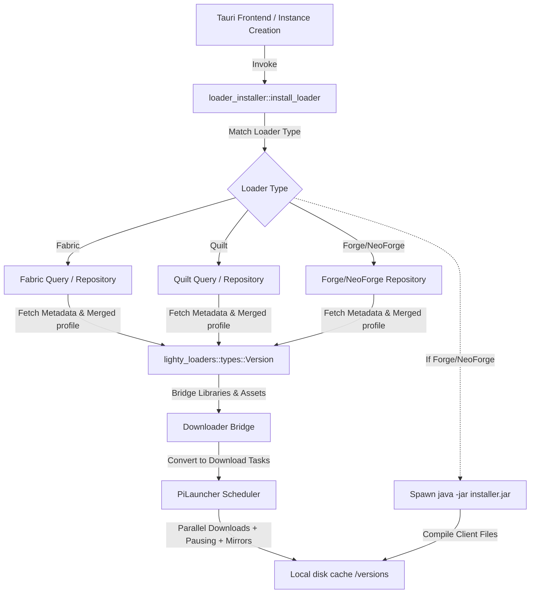

# PiLauncher Loader 下载与部署重构设计文档 (基于 Lighty v26.5.12)

本文档旨在详述将 PiLauncher 现有的 Fabric、Quilt、Forge 和 NeoForge 下载和部署逻辑重构为基于 **Lighty** 模块化组件（`lighty-loaders`, `lighty-launch` 等）的方案，同时确保不丢失原有的高性能网络特征（多线程下载、暂停/取消、重试机制、多次失败自动切换国内镜像源等）。

---

## 一、 背景与现状分析

### 1. 现有实现设计
PiLauncher 目前在 `src-tauri/src/services/downloader/loader_installer/` 目录下为 Fabric、Quilt、Forge、NeoForge 编写了独立的定制化逻辑：
* **Fabric/Quilt**：请求官方或国内镜像 Meta API，下载 profile JSON 文件并解析出依赖列表，然后将其传递给 PiLauncher 内部的 `download_dependencies` 执行多线程下载。
* **Forge/NeoForge**：下载 installer JAR 包，使用 ZIP 解包从中读取 `version.json` 和 `install_profile.json`，然后一方面调用外部 Java 进程执行处理器编译，另一方面下载依赖库文件。

### 2. 存在的主要痛点
* **代码重复与维护困难**：各自手写了 Maven 库路径解析、依赖冲突合并、系统规则（rules/os）过滤等逻辑，极易在 Minecraft 新版本（如 1.21+）或 Loader 发生破坏性变更时失效。
* **不规范的 ID 与目录命名**：部分 Forge/NeoForge 版本强行修改了版本 profile 中的 ID，导致文件完整性检查、失败清理和生命周期管理存在不一致风险。
* **缺少类型安全**：缺少强类型的库与元数据表示，完全依赖弱类型的 JSON/serde 对象进行手动遍历和过滤。

---

## 二、 重构目标与核心设计

### 1. 核心目标
* **消除自写解析逻辑**：使用 `lighty-loaders` v26.5.12 统一处理 Loader 版本的元数据解析、继承合并与类路径规划。
* **保持下载优势**：保留 PiLauncher 自带的多线程下载调度器、国内镜像源动态感知（BMCLAPI 切换）、暂停控制（Cancel Token）和 Tauri 实时进度推送。
* **无缝桥接**：将 Lighty 的强类型数据模型与 PiLauncher 的下载服务进行桥接。

### 2. 升级依赖组件
我们将 `Cargo.toml` 中的 `lighty-launch` 和 `lighty-loaders` 升级到最新 CalVer 版本：
```toml
lighty-launch = "26.5.12"
lighty-loaders = "26.5.12"
```

---

## 三、 详细架构设计与桥接方案



### 1. Lighty 强类型模型桥接
当从 `lighty-loaders` 拿到 `Version` 结构后，我们会遍历其中的 `libraries`、`assets` 等，生成 PiLauncher 下载任务：
```rust
// 伪代码示例：桥接 Lighty Version 依赖到本地多线程下载器
let mut download_tasks = Vec::new();
for lib in &version_builder.libraries {
    if let (Some(url), Some(path)) = (&lib.url, &lib.path) {
        // 使用 PiLauncher 的 mirror.rs 对 URL 进行国内镜像源重路由与多候选 URL 生成
        let urls = route_library_urls(url, &download_settings);
        let dest_path = global_mc_root.join("libraries").join(path);
        
        if needs_download(&dest_path, lib.sha1.as_ref()) {
            download_tasks.push(DownloadTask {
                urls,
                dest_path,
                sha1: lib.sha1.clone(),
                size: lib.size,
            });
        }
    }
}

// 递交给 PiLauncher 的多线程并发调度器
download_scheduler.download_parallel(download_tasks, cancel_token, progress_callback).await?;
```

### 2. 关键特性还原方案
* **多线程下载**：继续使用 `scheduler.rs` / `transfer.rs` 中的并发 Semaphore 控制，默认支持 32-64 线程并发，远超 Lighty 内置的 50 限制，且更适应复杂网络。
* **暂停与取消**：通过共享的 `Arc<AtomicBool>` 取消信号，在每个分块下载与任务循环中检查，随时可以中断，从而完美适配 Tauri 前端的暂停功能。
* **自动换源与重试**：PiLauncher 底层 `send_from_candidates` 支持传入多条 URL 候选。在下载出错或超时（15s）时，会自动重试并切换到下一条源（如优先自定义源 -> 自动换到 BMCLAPI -> 官方源），确保极高的连接成功率。

### 3. 具体 Loader 部署流程设计

#### A. Fabric / Quilt 部署
1. 调用 `lighty_loaders::loaders::fabric::FabricQuery` 传入游戏版本与 Loader 版本，触发 Full Data 缓存与解析。
2. `FabricQuery::version_builder` 将合并 vanilla 版本清单，生成干净的 `Version`。
3. 提取 libraries 依赖列表，生成带 Hash 强校验的桥接下载任务，送入下载引擎。
4. 将合并后的最终 profile JSON 写入 `versions/fabric-loader-{loader_version}-{mc_version}/fabric-loader-{loader_version}-{mc_version}.json`。

#### B. Forge / NeoForge 部署
1. 使用 `lighty-loaders` 下载与解析 Forge / NeoForge 的 installer JAR，从中获取 `install_profile.json` 和 `version.json` 的强类型表示。
2. 下载依赖清单中的库文件。
3. 保持现有与官方启动器等价的 Java 安装器兼容运行机制：执行 `java -jar installer.jar --installClient <global_mc_root>` 编译客户端所需要的运行库。
4. 清理临时下载的 installer JAR。

---

## 四、 接口定义与重构契约

为保持架构整洁，重构后的 `loader_installer` 模块只保留以下统一入口，不直接暴露 Reqwest 下载逻辑：

```rust
pub async fn install_loader<R: Runtime>(
    app: &AppHandle<R>,
    instance_id: &str,
    mc_version: &str,
    loader_type: &str,
    loader_version: &str,
    global_mc_root: &Path,
    cancel: &Arc<AtomicBool>,
) -> AppResult<InstalledLoaderInfo>;

#[derive(Debug, Clone)]
pub struct InstalledLoaderInfo {
    pub version_id: String,
    pub version_json_path: PathBuf,
}
```

任何 Loader 的失败都将在退出前清理新增目录，并由 Tauri 适配层抛出包装后的 `AppError::Generic` 到前端。

---

## 五、 验证与回退计划

### 1. 编译验证
* 执行 `cargo check` 验证 Lighty 强类型模型在 `args.rs` 以及新 `loader_installer` 中的类型一致性。
* 编写单元测试验证 `maven_artifact_to_path_and_url` 与 Lighty 内部解析结果的一致性。

### 2. 手动安装测试
* 在 Tauri 开发模式下测试 Fabric 1.20.1 / Quilt 1.20.1，确保能生成正确的目录并秒级完成完整性自验。
* 在 Tauri 开发模式下测试 Forge 1.20.1 / NeoForge 1.21，确保能拉起 Java 安装器，并且在无网或弱网环境下成功触发多源重试和换源。
